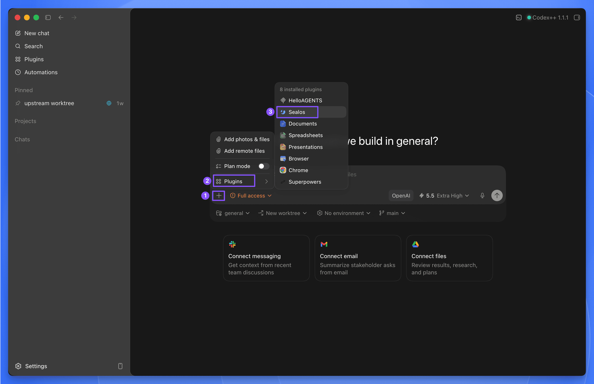

# Sealos Skills

<!-- README-I18N:START -->

[English](../README.md) | [简体中文](./README.zh-CN.md) | [繁體中文](./README.zh-TW.md) | [日本語](./README.ja.md) | [한국어](./README.ko.md) | [Español](./README.es.md) | [Français](./README.fr.md) | **Deutsch** | [Português (Brasil)](./README.pt-BR.md) | [Русский](./README.ru.md) | [العربية](./README.ar.md) | [हिन्दी](./README.hi.md) | [Bahasa Indonesia](./README.id.md)

<!-- README-I18N:END -->

Stelle Projekte über deinen KI-Agenten in [Sealos Cloud](https://sealos.io) bereit.

Sealos Skills ist ein Plugin-orientiertes Skill-Paket für die Entwicklung und Bereitstellung in Sealos Cloud. Es unterstützt einen KI-Agenten dabei, ein Projekt zu untersuchen und fehlende Bereitstellungsartefakte vorzubereiten. Es bindet Sealos Cloud-Datenbanken und Objektspeicher für die Entwicklung an. Es erstellt oder verwendet ein Container-Image wieder, stellt die Anwendung in Sealos Cloud bereit und zeigt die bereitgestellten Ressourcen in einer lokalen schreibgeschützten Canvas-Ansicht.

Ein einziger `npx plugins add`-Befehl installiert das Plugin in jedem erkannten Agentenwerkzeug. Native marketplace-Installationen für Codex und Claude Code verwenden dieselbe Quelle im Stammverzeichnis `skills/**`. Auch `skills.sh` und reine Kontext-Erweiterungshosts wie Gemini CLI und Qwen Code verwenden sie.

## Schnellstart

### TLDR

```bash
npx plugins add https://github.com/labring/sealos-skills
```

Ein Befehl installiert das Sealos-Plugin in jedem erkannten Agentenwerkzeug: Claude Code, Cursor, Codex, Grok Build, Kimi Code, GitHub Copilot CLI und VS Code. Führe `npx plugins targets` aus, um die erkannten Werkzeuge aufzulisten, oder übergib `--target <tool>`, um nur in einem Werkzeug zu installieren.

### Nativ in Codex installieren

Füge dieses Repository als Codex marketplace hinzu und installiere anschließend das Sealos-Plugin:

```bash
codex plugin marketplace add labring/sealos-skills
codex plugin add sealos@sealos
```

Das Plugin installiert alle acht Skills aus dem Stammverzeichnis `skills/**`. Was die einzelnen Skills leisten, findest du unten unter **Enthaltene Skills**.

Nach der Installation in Codex verwendest du das Plugin über Codex:

- **Codex CLI:** `$sealos` eingeben
- **Codex App:** auf die Schaltfläche **+** unten links im Chat-Eingabefeld klicken, anschließend **Plugins** → **Sealos** auswählen



Codex-Beispiele:

```text
$sealos deploy this repo to Sealos Cloud
$sealos deploy /path/to/project
$sealos deploy https://github.com/labring-sigs/kite
$sealos create a cloud Postgres database for this repo and wire DATABASE_URL
$sealos create private S3 object storage for uploads and wire env vars
```

### Nativ in Claude Code installieren

Füge dieses Repository als Claude Code marketplace hinzu und installiere anschließend das Sealos-Plugin:

```bash
claude plugin marketplace add labring/sealos-skills
claude plugin install sealos@sealos
```

Nach der Installation in Claude Code verwendest du `/sealos`:

```text
/sealos deploy this repo to Sealos Cloud
/sealos deploy /path/to/project
/sealos deploy https://github.com/labring-sigs/kite
/sealos create a cloud Postgres database for this repo and wire DATABASE_URL
/sealos create private S3 object storage for uploads and wire env vars
```

### Unterstützte KI-Werkzeuge

| Werkzeug | Installation | Verwendung |
| --- | --- | --- |
| Codex CLI / Codex App | `npx plugins add https://github.com/labring/sealos-skills --target codex` oder siehe **Nativ in Codex installieren** oben | `$sealos` in Codex CLI oder **+** → **Plugins** → **Sealos** in Codex App |
| Claude Code | `npx plugins add https://github.com/labring/sealos-skills --target claude-code` oder siehe **Nativ in Claude Code installieren** oben | `/sealos` |
| Cursor / Grok Build / Kimi Code / Copilot CLI / VS Code | `npx plugins add https://github.com/labring/sealos-skills` | Host-Befehlseinstieg nach der Installation |
| OpenClaw / ClawHub | `clawhub install labring/sealos-skills` | Die Bereitstellung von Hostbefehlen hängt von der ClawHub-Laufzeit ab |
| CodeBuddy | `/plugin marketplace add labring/sealos-skills` | Die Bereitstellung von Hostbefehlen hängt von der CodeBuddy-Laufzeit ab |
| Gemini CLI | `gemini extensions install https://github.com/labring/sealos-skills` | Reine Kontext-Erweiterung; Gemini zur Verwendung von Sealos Skills auffordern |
| Qwen Code | `qwen extensions install https://github.com/labring/sealos-skills` | Reine Kontext-Erweiterung; Qwen zur Verwendung von Sealos Skills auffordern |
| Amp / allgemeine Repository-Importer | `https://github.com/labring/sealos-skills.git` importieren | Hostabhängig |

Die Manifeste für Gemini CLI und Qwen Code stellen den Repository-Kontext über `CLAUDE.md` bereit. Sie geben keine Unterstützung für Slash-Befehle an.

### Alternative: als `skills.sh`-Skill-Paket installieren

Wenn dein Agent `skills.sh` direkt verwendet, installierst du dasselbe Skill-Paket so:

```bash
npx skills add labring/sealos-skills
```

Führe anschließend den Bereitstellungs-Skill direkt aus:

```text
/sealos-deploy
/sealos-deploy /path/to/project
/sealos-deploy https://github.com/labring-sigs/kite
/sealos-database create a cloud Postgres database for this repo and wire DATABASE_URL
/sealos-s3 create private object storage for uploads and wire env vars
```

Wenn das Projekt bereitgestellt ist, verwendest du den Skill `sealos-canvas` über den Einstiegspunkt des installierten Plugins.

`/sealos-deploy`, `/sealos-database` und `/sealos-s3` sind direkte `skills.sh`-Skill-Einstiege. Für die Plugin-Verwendung musst du `$sealos` in Codex oder `/sealos` in Claude Code nutzen.

## Was Sealos Deploy übernimmt

Bei einer typischen Bereitstellung führt der Agent Folgendes aus:

- bewertet die Projektstruktur und Laufzeitanforderungen
- verwendet ein vorhandenes Image wieder oder erstellt bei Bedarf ein neues
- erzeugt eine Sealos-Vorlage
- stellt bereit und überprüft den Rollout
- überprüft die tatsächliche Sealos App-URL, Logs, den Anmelde- oder Einrichtungsablauf für Webanwendungen sowie den Ressourcenbestand, bevor die Anwendung als einsatzbereit gemeldet wird

Wenn eine Bereitstellung vorhanden ist, wechseln spätere Ausführungen zu einem direkten Aktualisierungsablauf.

## Was Sealos Database übernimmt

Für ein lokales Projekt oder eine Devbox, die eine Cloud-Datenbank benötigt, führt der Agent Folgendes aus:

- erkennt Datenbanksignale wie `DATABASE_URL`, Prisma, Drizzle, MongoDB, MySQL oder Redis
- verwendet `sealos-cli database`, um Sealos Cloud-Datenbanken aufzulisten, zu erstellen, zu untersuchen und zu verbinden
- schreibt nur den erforderlichen lokalen Umgebungsvariablenschlüssel, ohne Geheimnisse im Chat offenzulegen
- überprüft den tatsächlichen Datenbankpfad der Anwendung durch Migrationen, Introspektion oder Startprüfungen
- verwaltet öffentlichen Zugriff erst nach Bestätigung

## Was Sealos S3 übernimmt

Für ein lokales Projekt oder eine Devbox, die S3-kompatiblen Objektspeicher benötigt, führt der Agent Folgendes aus:

- erkennt Objektspeichersignale wie S3-Umgebungsvariablen, AWS SDK-Nutzung, MinIO, Upload-Pfade oder Code für vorsignierte URLs
- verwendet `sealos-cli s3` aus `zjy365/sealos-cli#28`, um Objektspeicher-Buckets aufzulisten, zu erstellen, zu untersuchen und zu aktualisieren
- initialisiert S3-Zugangsdaten nur bei Bedarf und hält Zugriffsschlüssel aus dem Chat fern
- bindet nur die minimal erforderlichen lokalen Umgebungsvariablen für Bucket, Endpoint, Zugriffsschlüssel, geheimen Schlüssel, Region und Pfadstil-Einstellungen ein
- überprüft Upload, Auflistung, Download, Löschung oder vorsignierte URLs über den tatsächlichen Speicherpfad des Projekts
- veröffentlicht Buckets oder rotiert Zugangsdaten erst nach Bestätigung

## Was Sealos Canvas übernimmt

Für ein Repository, das bereits mit Sealos Deploy bereitgestellt wurde, führt der Agent Folgendes aus:

1. Liest `.sealos/state.json`, um die bereitgestellte Anwendung zu finden.
2. Fragt den Sealos-Namespace mit schreibgeschützten `kubectl get`-Befehlen ab.
3. Startet vorübergehend eine Canvas-Oberfläche unter `127.0.0.1`.
4. Gibt die lokale UI-Adresse zur Überprüfung aus und öffnet sie.

Wenn das Projekt nicht bereitgestellt ist, hält Sealos Canvas an und fordert den Benutzer auf, zuerst das Projekt bereitzustellen.

## So funktioniert die Einrichtung

Du benötigst nur einen Plugin- oder `skills.sh`-kompatiblen KI-Agenten und ein Projekt, das bereitgestellt werden soll.

Während der Abläufe für Bereitstellung, Datenbank und Objektspeicher führt Sealos Skills Folgendes aus:

- prüft, ob Werkzeuge wie Docker und `kubectl` verfügbar sind
- führt den Benutzer bei Bedarf durch die Sealos-Anmeldung
- verwendet `sealos-cli`, um Sealos Cloud-Datenbanken zu erstellen, Verbindungsdetails abzurufen und Datenbankoperationen auszuführen
- verwendet `sealos-cli s3` für Sealos-Objektspeicher-Buckets, Zugangsdaten, Kontingentprüfungen, Objektoperationen und vorsignierte URLs
- verwendet oder hilft bei der Vorbereitung eines Container-Registry-Pfads wie Docker Hub oder GHCR

Für eine tatsächliche Bereitstellung benötigst du ein Sealos Cloud-Konto und Zugriff auf eine Container-Registry. Der Skill kann dich nach seinem Start durch diese Einrichtung führen. Für Datenbank- und Objektspeicherarbeiten benötigst du ein Sealos Cloud-Konto und einen Workspace, der die angeforderten Ressourcen erstellen kann.

## Enthaltene Skills

Das Plugin und das `skills.sh`-Paket stellen dieselbe Skill-Quelle bereit:

- `sealos-deploy` — stellt ein lokales oder GitHub-Projekt in Sealos Cloud bereit
- `sealos-database` — erstellt, verbindet und betreibt Sealos Cloud-Datenbanken für die Entwicklung
- `sealos-s3` — erstellt Buckets, bindet Zugangsdaten ein, prüft Kontingente und betreibt Sealos S3-kompatiblen Objektspeicher
- `sealos-canvas` — zeigt bereitgestellte Sealos-Ressourcen in einer lokalen schreibgeschützten Canvas-Oberfläche an
- `sealos-app-builder` — erstellt Sealos Desktop-Anwendungen mit SDK-Integration
- `cloud-native-readiness` — bewertet die Bereitstellungsbereitschaft
- `dockerfile-skill` — erzeugt produktionsreife Dockerfiles
- `docker-to-sealos` — wandelt Docker Compose-Dienste in Sealos-Vorlagen um

## Warum das Plugin verwenden

Die Plugin-Installation wird für Codex, Claude Code und die anderen unterstützten Agentenwerkzeuge empfohlen, weil sie:

- alle Sealos-Skills als ein verwaltetes Paket installiert
- dieselben Skills in allen unterstützten Agentenwerkzeugen bereitstellt
- Plugin-Metadaten, Logo, Prompts, Befehle und Funktionen zusammenhält
- die Pflege einer separaten Paketkopie der Skills vermeidet

## Pflege dieses Repositorys

Die folgenden Abschnitte richten sich an Repository-Betreuer und Plugin-Herausgeber. Benutzer benötigen sie nicht.

### Plugin-Verteilung

Die Codex-Integration folgt dem [OpenAI-Leitfaden zum Erstellen von Codex-Plugins](https://developers.openai.com/codex/plugins/build):

- `.codex-plugin/plugin.json` enthält die Plugin-Identität, Discovery-Metadaten, Oberflächentexte, Standard-Prompts, Markenmetadaten und Asset-Pfade relativ zum Repository-Stammverzeichnis.
- `.agents/plugins/marketplace.json` registriert das lokale Plugin dieses Repositorys für lokale Codex marketplace-Tests.
- `.claude-plugin/plugin.json` und `.claude-plugin/marketplace.json` definieren die Claude Code-kompatible Plugin-Oberfläche.
- `.qoder-plugin/plugin.json` definiert die Qoder-Plugin-Oberfläche und stellt explizit alle acht Codex-Skills bereit.
- `qoder.md` stellt Routing- und Sicherheitsanweisungen auf Qoder-Ebene bereit, ohne Skill-Implementierungen zu kopieren.
- `distribution/platforms.json` dokumentiert Angaben zur Plattformunterstützung und deren Nachweise.
- `marketplaces/README.md` verwaltet die marketplace-Regeln und verhindert überzogene Angaben zur Befehlsunterstützung.
- `scripts/validate-codex-plugin.py` prüft das Codex-Manifest, Claude Code-Metadaten, Repository-marketplaces, die Plattformregistrierung und Asset-Pfade.
- `scripts/package-qoder-plugin.py` erstellt ein Qoder-kompatibles ZIP mit dem Plugin-Manifest im Archivstamm.
- `skills/**/SKILL.md` bleibt die einzige Skill-Quelle; füge keine zweite Paketkopie der Skills hinzu.

Validiere die Plugin-Metadaten, bevor du Manifeständerungen veröffentlichst oder pushst:

```bash
python3 scripts/validate-codex-plugin.py
python3 -m json.tool .codex-plugin/plugin.json >/dev/null
python3 -m json.tool plugin.json >/dev/null
python3 -m json.tool .agents/plugins/marketplace.json >/dev/null
python3 -m json.tool marketplace.json >/dev/null
python3 -m json.tool .claude-plugin/plugin.json >/dev/null
python3 -m json.tool .claude-plugin/marketplace.json >/dev/null
python3 -m json.tool .qoder-plugin/plugin.json >/dev/null
python3 -m json.tool distribution/platforms.json >/dev/null
```

### Repository-Layout

[`skills/`](../skills) ist die einzige verlässliche Quelle für Sealos Deploy, Sealos Canvas und die unterstützenden Skills im Bereitstellungsablauf. Dasselbe Skill-Verzeichnis im Stamm dient `skills.sh`-Installationen und allen Plugin- oder Erweiterungsmanifesten in diesem Repository.

Wichtige Verteilungsdateien:

- [`.codex-plugin/plugin.json`](../.codex-plugin/plugin.json) — Codex-Plugin-Manifest
- [`.agents/plugins/marketplace.json`](../.agents/plugins/marketplace.json) — lokaler Codex marketplace-Eintrag
- [`.claude-plugin/plugin.json`](../.claude-plugin/plugin.json) — Claude Code-kompatibles Plugin-Manifest
- [`.qoder-plugin/plugin.json`](../.qoder-plugin/plugin.json) — Qoder-Plugin-Manifest
- [`qoder.md`](../qoder.md) — Routing- und Sicherheitsanweisungen des Qoder-Plugins
- [`marketplace.json`](../marketplace.json) und [`.claude-plugin/marketplace.json`](../.claude-plugin/marketplace.json) — Claude-kompatible marketplace-Einträge
- [`.codebuddy-plugin/marketplace.json`](../.codebuddy-plugin/marketplace.json) — CodeBuddy marketplace-Eintrag
- [`gemini-extension.json`](../gemini-extension.json) — Gemini CLI-Kontexterweiterung
- [`qwen-extension.json`](../qwen-extension.json) — Qwen Code-Kontexterweiterung
- [`openclaw.plugin.json`](../openclaw.plugin.json) — Verweis auf das OpenClaw / ClawHub-Paket
- [`commands/sealos.md`](../commands/sealos.md) — `/sealos`-Plugin-Befehlseinstieg für kompatible Hosts
- [`distribution/platforms.json`](../distribution/platforms.json) — Registrierung der Plattformunterstützung
- [`marketplaces/README.md`](../marketplaces/README.md) — marketplace-Regeln und Zuständigkeit für Unterstützungsangaben
- [`scripts/validate-codex-plugin.py`](../scripts/validate-codex-plugin.py) — Prüfskript für das Codex-Plugin
- [`scripts/package-qoder-plugin.py`](../scripts/package-qoder-plugin.py) — Qoder-ZIP-Paketierer

Füge keine zweite Paketkopie der Skills hinzu. Das Stammverzeichnis `skills/**` ist die einzige Skill-Quelle für alle Installationswege.

## Lizenz

MIT
